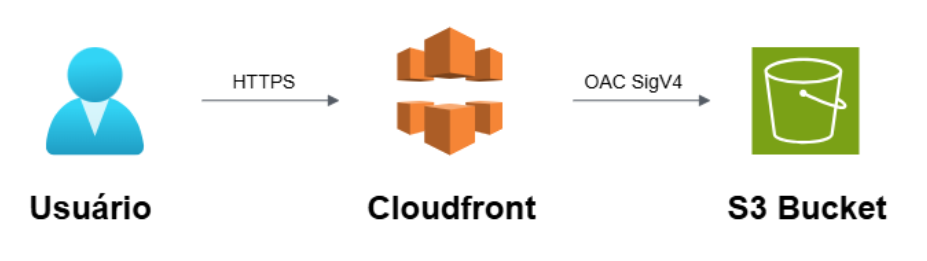

# 🌐 Pokédex na AWS com Terraform (S3 + CloudFront + OAC)

Este projeto provisiona automaticamente uma infraestrutura **segura** na
AWS para hospedar um site estático (Pokédex):

-   **Amazon S3** → Armazena os arquivos do site (HTML, CSS, JS,
    imagens).
-   **CloudFront** → Distribui o conteúdo globalmente, com HTTPS.
-   **OAC (Origin Access Control)** → Garante que apenas o CloudFront
    pode acessar o bucket.
-   **Terraform** → Toda a infraestrutura como código (IaC), incluindo o
    upload automático do site.

------------------------------------------------------------------------

## Arquitetura de Solucões na AWS



------------------------------------------------------------------------

## 🗂️ Estrutura de pastas

```
pokedex-s3-cloudfront/
├── pokedex/
│   ├── src/
│   │   ├── css/
│   │   ├── imagens/
│   │   └── js/
│   └── index.html
├── arquitetura/
│   └── arquitetura.png
├── main.tf
├── variables.tf
├── outputs.tf
├── providers.tf
└── README.md

```

------------------------------------------------------------------------

## 📋 Requisitos

- Conta ativa na **AWS**
- **AWS CLI** ou **PowerShell** para execução dos comandos
- **Access Key ID** e **Secret Access Key** de um usuário IAM configurado

------------------------------------------------------------------------

## 🔑 Configuração da AWS CLI

Antes de rodar o Terraform, configure suas credenciais AWS no terminal:

```bash
aws configure
```

Informe:

- **AWS Access Key ID**
- **AWS Secret Access Key**
- Região padrão (exemplo: `us-east-1`)
- Formato de saída (`json`)

------------------------------------------------------------------------

## 🚀 Como executar

### 1. Clonar o repositório

``` bash
git clone https://github.com/brunocco/pokedex-s3-cloudfront.git
cd pokedex-s3-cloudfront
```

### 2. Inicializar o Terraform

``` bash
terraform init
```

### 3. Aplicar a infraestrutura

``` bash
terraform apply -auto-approve
```

➡️ Isso vai: 
- Criar o bucket S3, CloudFront e OAC  
- Subir automaticamente os arquivos da pasta `pokedex/` para o bucket  
- Retornar a URL do site no **output**

### 4. Acessar o site

Após o apply, veja a saída:

```
cloudfront_url = https://xxxxxxxx.cloudfront.net
```

------------------------------------------------------------------------

## 📌 Upload do site

O upload dos arquivos da Pokédex pode ser feito de duas formas:

### 🔹 Abordagem 1 --- Manual (boa prática)

Separar **infraestrutura** do **conteúdo**:

``` bash
aws s3 sync ./pokedex s3://NOME_DO_BUCKET --delete
```

### 🔹 Abordagem 2 --- Automatizada (usada neste projeto)

Neste projeto utilizei o recurso `null_resource + local-exec` para rodar
o comando `aws s3 sync` automaticamente durante o `terraform apply`.

Assim, a infraestrutura **e** os arquivos do site são provisionados de
uma só vez.  
Essa abordagem não é a mais recomendada em ambientes de produção, mas é
excelente para aprendizado e demonstração prática de automação total.

------------------------------------------------------------------------

## 🔒 Segurança aplicada

-   Bloqueio de acesso público no bucket S3  
-   Criptografia SSE-AES256 no S3  
-   Uso de **CloudFront + OAC** para acesso seguro  
-   Redirecionamento HTTP → HTTPS

------------------------------------------------------------------------

## 🧹 Como apagar a infraestrutura (Terraform Destroy)

Para evitar custos desnecessários na AWS, você pode remover todos os recursos 
criados pelo Terraform usando o comando destroy.

1️⃣ Entrar na pasta do projeto
``` bash
cd C:\caminho\para\pokedex-s3-cloudfront
```

2️⃣ Executar Terraform Destroy
``` bash
terraform destroy -auto-approve
```
Isso irá remover todos os recursos provisionados pelo Terraform, incluindo:

-   Bucket S3
-   Distribuição CloudFront
-   Origin Access Control (OAC)

3️⃣ Confirmar remoção

Verifique no console da AWS:

-   S3 → Buckets → o bucket deve ter sido apagado
-   CloudFront → Distribuições → a distribuição deve ter sido removida
-   OAC → removido automaticamente

💡 Dica: Se você criou recursos manualmente fora do Terraform, verifique e apague também para não gerar custos.

------------------------------------------------------------------------

## 🛠️ Tecnologias usadas

-   AWS (S3, CloudFront, IAM)
-   Terraform
-   AWS CLI
-   Infraestrutura como Código (IaC)

------------------------------------------------------------------------

## ✨ Resultado

-   Site estático hospedado de forma **segura** e **automatizada** na AWS  
-   Infraestrutura totalmente versionada e reproduzível com Terraform  
-   Demonstração prática de **IaC + Segurança + Automação**
